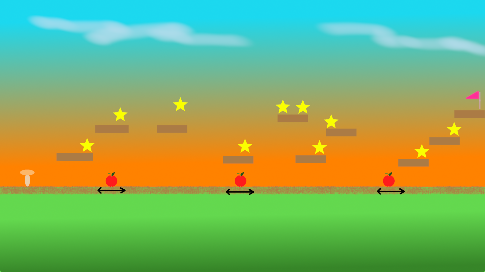

# Harjoitustyön suunnitelma

## Tietoja

Tekijä: Pekko Hjelt

Työ git-varaston osoite: <https://github.com/nerdpeksi/ohj1ht>

Pelin nimi: Sienipeli

Pelialusta: Windows

Pelaajien lukumäärä: 1

## Pelin tarina

Sieni lähtee keräämään tähtösiä.

## Pelin idea ja tavoitteet

Pelin tavoitteena on kerätä mahdollisimman monta tähtöstä pelikentältä. Omenoihin osumista kannattaa välttää, sillä ne syövät tähdistä saatuja pisteitä. Omenan päälle hyppäämällä sen saa hajoitettua, myös tästä tienaa pisteitä.

## Hahmotelma pelistä

kuvan kenttä on lyhennetty mallikuva

## Toteutuksen suunnitelma

Heinäkuu

- Hahmojen luonti
- Controllien totetutus
- Fysiikan hionta

Elokuu

- Pelikentän luonti
- Pistelaskurin luonti
- Testausta ja hiontaa

Jos aikaa jää

- animaatioita
- lisää animaatioita
- pidempi kenttä
